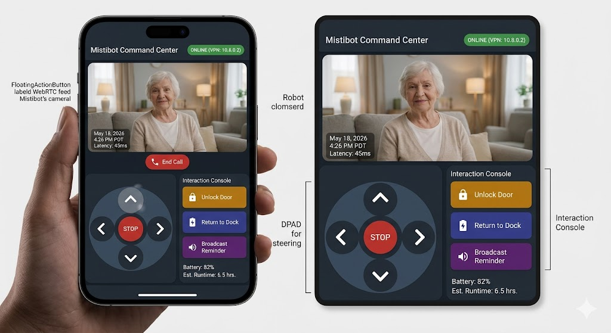
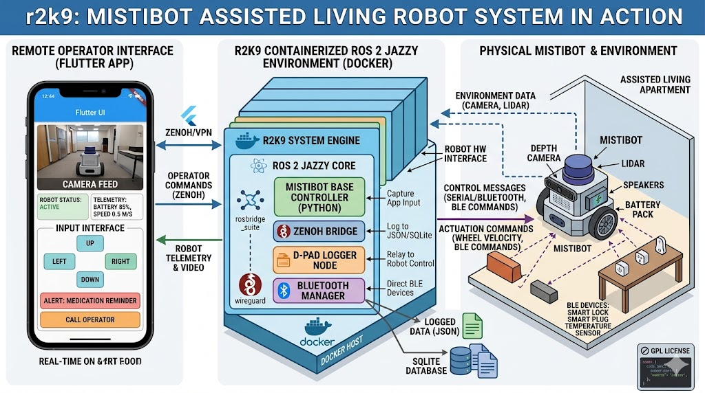

# r2k9 assistive robot

## Introduction

R2K9 is an open source autonomous robot for assistive living. It appears to be a robot toy, wandering about a patient's living space seemingly at random. However, it is intended to keep track of people within an assisted living space. R2K9 is aware which people are patients and which people are care givers. R2K9 will discreetly track the status of patients making sure they are moving naturally and not exhibiting signs of distress.



R2K9 will be able to interact with its environment with wireless technology such as Bluetooth. For example, R2K9 can converse with a patient via a Bluetooth speaker and lock and unlock bluetooth enabled doors (for example to stop a dementia patient from wandering off).



R2K9 comes with a companion app, used by a care giver to monitor a patient. If a patients stops moving when they are in an unnatural position (such as fallen down on the floor) or the patient calls for help, the care giver can use the app to teleconference with the patient to address their state. The caregiver can use the app to have R2K9 unlock a door to allow access to maintenance or emergency personnel. R2K9 will not automatically summon emergency personnel, but instead give the care giver enough information to do that.

Privacy is an important for R2K9. As the robot is autonomous, there is no interaction with a server and informations is kept strictly within a virtual private network (VPN). Modern robots are a distributed network of computing devices, rather than a single physical device. Indeed ROS2 messages are transmitted across the network unencrypted as the assumption is that all machines within the VPN are trusted.

Rather than equip and environment with multiple cameras and microphones, R2K9 effectively moves a single camera and microphone around the living space, like a tiny security guard.

## Installation

R2K9 requires [ROS2 Jazzy](https://docs.ros.org/en/jazzy/index.html) and [flutter](https://flutter.dev/)

### Control app

Build and run the control app

```
TARGET=chrome
cd r2k9ui
flutter build $TARGET
flutter run $TARGET
```

### Build and test the r2k9 ROS2 node

```
docker build -t r2k9_node docker
docker run -it --rm --net=host r2k9_node cmd
```

## Operation

Find the URL of the webhooks TODO

```
docker run -it --rm --net=host r2k9_node TODO
```

## Development

The password is `r2k9`

## TODO

Look into using Zenoh instead of webhooks.


